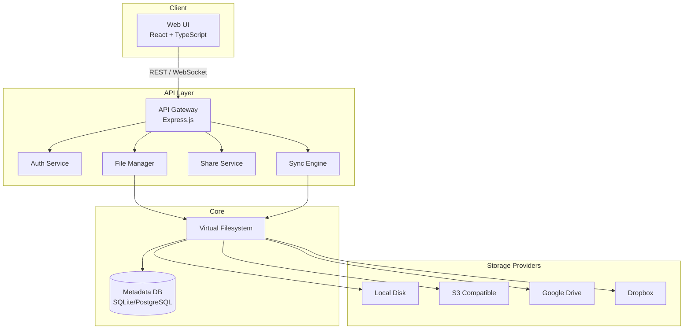

# Design Document: Mini-NAS

## Overview

Mini-NAS는 로컬 스토리지와 다양한 클라우드 스토리지(S3, Google Drive, Dropbox)를 단일 웹 인터페이스에서 통합 관리하는 웹 기반 NAS 시스템이다. 사용자는 브라우저를 통해 파일 업로드/다운로드, 폴더 관리, 클라우드 동기화, 파일 공유 등의 기능을 사용할 수 있다.

핵심 설계 목표:
- 다양한 스토리지 백엔드를 단일 가상 파일 시스템으로 추상화
- 대용량 파일 처리를 위한 청크 업로드 및 스트리밍 다운로드
- JWT 기반 인증과 역할 기반 접근 제어
- 실시간 동기화 및 충돌 감지

## Architecture



### 기술 스택

- **Mono Repo**: turberepo
- **Backend**: Nest.js + fastify (TypeScript)
- **Frontend**: svelte + TypeScript
- **Database**: SQLite (개발) / PostgreSQL (프로덕션)
- **인증**: JWT (jsonwebtoken), bcrypt
- **파일 처리**: multer, node-streams
- **클라우드 SDK**: googleapis (Google Drive)
- **실시간 통신**: WebSocket (ws 라이브러리)
- **암호화**: Node.js crypto (AES-256-GCM)

## Components and Interfaces

### Auth Service

```typescript
interface AuthService {
  login(username: string, password: string): Promise<{ token: string; expiresAt: Date }>;
  logout(token: string): Promise<void>;
  validateToken(token: string): Promise<TokenPayload>;
  refreshToken(token: string): Promise<{ token: string; expiresAt: Date }>;
}

interface TokenPayload {
  userId: string;
  username: string;
  iat: number;
  exp: number;
}
```

JWT 토큰 만료 시간은 24시간으로 설정하며, 로그아웃 시 토큰을 블랙리스트(Redis 또는 DB)에 등록하여 무효화한다. 비밀번호 5회 연속 실패 시 계정을 15분간 잠금 처리한다.

### Virtual Filesystem

```typescript
interface VirtualFilesystem {
  mount(provider: StorageProvider, mountPath: string): Promise<void>;
  unmount(mountPath: string): Promise<void>;
  listDirectory(path: string): Promise<FileEntry[]>;
  getMetadata(path: string): Promise<FileMetadata>;
  getMountStatus(): MountStatus[];
}

interface FileMetadata {
  name: string;
  size: number;
  modifiedAt: Date;
  storageSource: string;   // 마운트 경로 기준 출처
  mimeType: string;
  md5Checksum?: string;
}

interface MountStatus {
  mountPath: string;
  providerType: ProviderType;
  status: 'online' | 'offline';
  error?: string;
}

type ProviderType = 'local' | 's3' | 'google-drive' | 'dropbox';
```

### File Manager

```typescript
interface FileManager {
  upload(path: string, stream: Readable, options: UploadOptions): Promise<UploadResult>;
  download(path: string, range?: ByteRange): Promise<DownloadResult>;
  createFolder(path: string): Promise<void>;
  rename(path: string, newName: string): Promise<void>;
  move(srcPath: string, destPath: string): Promise<void>;
  copy(srcPath: string, destPath: string): Promise<void>;
  delete(path: string): Promise<void>;
  search(query: SearchQuery): Promise<FileEntry[]>;
}

interface UploadOptions {
  chunkSize?: number;       // 기본 5MB
  resumeToken?: string;
  overwritePolicy: 'rename' | 'overwrite' | 'error';
}

interface UploadResult {
  path: string;
  md5Checksum: string;
  resumeToken?: string;
}

interface ByteRange {
  start: number;
  end: number;
}

interface SearchQuery {
  keyword: string;
  fileType?: string;
  sizeRange?: { min?: number; max?: number };
  dateRange?: { from?: Date; to?: Date };
}
```

### Share Service

```typescript
interface ShareService {
  createShareLink(path: string, options: ShareOptions): Promise<ShareLink>;
  getShareLink(token: string, password?: string): Promise<ShareLinkInfo>;
  revokeShareLink(token: string): Promise<void>;
  trackDownload(token: string): Promise<void>;
}

interface ShareOptions {
  expiresAt?: Date;
  password?: string;
  maxDownloads?: number;
}

interface ShareLink {
  token: string;
  url: string;
  expiresAt?: Date;
  maxDownloads?: number;
}
```

### Sync Engine

```typescript
interface SyncEngine {
  startSync(config: SyncConfig): Promise<SyncJob>;
  stopSync(jobId: string): Promise<void>;
  getSyncStatus(jobId: string): Promise<SyncStatus>;
  resolveConflict(conflictId: string, resolution: ConflictResolution): Promise<void>;
}

interface SyncConfig {
  sourceProvider: string;
  targetProvider: string;
  direction: 'one-way' | 'two-way';
  sourcePath: string;
  targetPath: string;
}

interface SyncStatus {
  jobId: string;
  state: 'running' | 'paused' | 'completed' | 'error';
  progress: { total: number; completed: number; failed: number };
  conflicts: SyncConflict[];
  errors: SyncError[];
}

type ConflictResolution = 'use-source' | 'use-target' | 'keep-both';
```

### Storage Provider Interface

```typescript
interface StorageProvider {
  type: ProviderType;
  connect(credentials: ProviderCredentials): Promise<void>;
  disconnect(): Promise<void>;
  list(path: string): Promise<FileEntry[]>;
  read(path: string, range?: ByteRange): Promise<Readable>;
  write(path: string, stream: Readable): Promise<void>;
  delete(path: string): Promise<void>;
  move(srcPath: string, destPath: string): Promise<void>;
  getMetadata(path: string): Promise<FileMetadata>;
}
```

인증 정보(`ProviderCredentials`)는 AES-256-GCM으로 암호화하여 DB에 저장한다.

## Data Models

### User

```sql
CREATE TABLE users (
  id          UUID PRIMARY KEY DEFAULT gen_random_uuid(),
  username    VARCHAR(64) UNIQUE NOT NULL,
  password_hash VARCHAR(255) NOT NULL,   -- bcrypt
  failed_attempts INTEGER DEFAULT 0,
  locked_until  TIMESTAMP,
  created_at  TIMESTAMP DEFAULT NOW(),
  updated_at  TIMESTAMP DEFAULT NOW()
);
```

### Token Blacklist

```sql
CREATE TABLE token_blacklist (
  jti         VARCHAR(255) PRIMARY KEY,  -- JWT ID
  expires_at  TIMESTAMP NOT NULL,
  created_at  TIMESTAMP DEFAULT NOW()
);
```

### Storage Provider

```sql
CREATE TABLE storage_providers (
  id              UUID PRIMARY KEY DEFAULT gen_random_uuid(),
  user_id         UUID REFERENCES users(id),
  type            VARCHAR(32) NOT NULL,   -- 'local' | 's3' | 'google-drive' | 'dropbox'
  mount_path      VARCHAR(512) UNIQUE NOT NULL,
  credentials_enc TEXT NOT NULL,          -- AES-256-GCM 암호화된 JSON
  status          VARCHAR(16) DEFAULT 'online',
  created_at      TIMESTAMP DEFAULT NOW()
);
```

### File Metadata

```sql
CREATE TABLE file_metadata (
  id              UUID PRIMARY KEY DEFAULT gen_random_uuid(),
  provider_id     UUID REFERENCES storage_providers(id),
  virtual_path    VARCHAR(1024) NOT NULL,
  name            VARCHAR(255) NOT NULL,
  size            BIGINT,
  mime_type       VARCHAR(128),
  md5_checksum    VARCHAR(32),
  modified_at     TIMESTAMP,
  is_directory    BOOLEAN DEFAULT FALSE,
  created_at      TIMESTAMP DEFAULT NOW(),
  UNIQUE(provider_id, virtual_path)
);
```

### Share Link

```sql
CREATE TABLE share_links (
  id              UUID PRIMARY KEY DEFAULT gen_random_uuid(),
  token           VARCHAR(128) UNIQUE NOT NULL,
  file_path       VARCHAR(1024) NOT NULL,
  password_hash   VARCHAR(255),           -- NULL이면 비밀번호 없음
  expires_at      TIMESTAMP,
  max_downloads   INTEGER,
  download_count  INTEGER DEFAULT 0,
  is_active       BOOLEAN DEFAULT TRUE,
  created_at      TIMESTAMP DEFAULT NOW()
);
```

### Sync Job

```sql
CREATE TABLE sync_jobs (
  id              UUID PRIMARY KEY DEFAULT gen_random_uuid(),
  user_id         UUID REFERENCES users(id),
  source_provider UUID REFERENCES storage_providers(id),
  target_provider UUID REFERENCES storage_providers(id),
  direction       VARCHAR(16) NOT NULL,   -- 'one-way' | 'two-way'
  source_path     VARCHAR(512),
  target_path     VARCHAR(512),
  state           VARCHAR(16) DEFAULT 'pending',
  progress_json   JSONB,
  created_at      TIMESTAMP DEFAULT NOW(),
  updated_at      TIMESTAMP DEFAULT NOW()
);

CREATE TABLE sync_conflicts (
  id              UUID PRIMARY KEY DEFAULT gen_random_uuid(),
  job_id          UUID REFERENCES sync_jobs(id),
  file_path       VARCHAR(1024) NOT NULL,
  resolution      VARCHAR(16),            -- NULL이면 미해결
  created_at      TIMESTAMP DEFAULT NOW()
);
```

### Upload Session (청크 업로드)

```sql
CREATE TABLE upload_sessions (
  id              UUID PRIMARY KEY DEFAULT gen_random_uuid(),
  resume_token    VARCHAR(128) UNIQUE NOT NULL,
  target_path     VARCHAR(1024) NOT NULL,
  total_size      BIGINT,
  uploaded_bytes  BIGINT DEFAULT 0,
  last_chunk_idx  INTEGER DEFAULT -1,
  expires_at      TIMESTAMP,
  created_at      TIMESTAMP DEFAULT NOW()
);
```

## Correctness Properties

*A property is a characteristic or behavior that should hold true across all valid executions of a system — essentially, a formal statement about what the system should do. Properties serve as the bridge between human-readable specifications and machine-verifiable correctness guarantees.*

### Property 1: 유효한 자격증명으로 로그인 시 JWT 토큰 발급

*For any* 유효한 사용자 자격증명(username, password)으로 로그인 요청을 보내면, 응답에는 반드시 JWT 토큰이 포함되어야 하며 해당 토큰의 만료 시간은 발급 시점으로부터 24시간이어야 한다.

**Validates: Requirements 1.1, 1.2**

### Property 2: 유효하지 않은 토큰 거부

*For any* 만료되었거나 로그아웃으로 무효화된 JWT 토큰으로 보호된 엔드포인트에 요청을 보내면, 시스템은 반드시 401 상태 코드를 반환해야 한다.

**Validates: Requirements 1.3, 1.6**

### Property 3: 비밀번호 5회 실패 시 계정 잠금

*For any* 계정에 대해 잘못된 비밀번호로 5회 연속 로그인 시도를 하면, 해당 계정은 15분간 잠금 처리되어 올바른 비밀번호로도 로그인이 거부되어야 한다.

**Validates: Requirements 1.4**

### Property 4: 비밀번호 bcrypt 해시 저장

*For any* 비밀번호로 사용자를 생성하거나 비밀번호를 변경하면, DB에 저장된 값은 평문이 아닌 bcrypt 해시여야 하며 bcrypt.compare로 원본 비밀번호와 일치해야 한다.

**Validates: Requirements 1.5**

### Property 5: 스토리지 프로바이더 마운트/언마운트 라운드트립

*For any* 스토리지 프로바이더를 임의의 마운트 경로에 마운트한 후 언마운트하면, 해당 경로는 파일 트리에서 제거되어야 하며 나머지 마운트 경로는 영향을 받지 않아야 한다.

**Validates: Requirements 2.2, 2.3**

### Property 6: 파일 메타데이터 완전성

*For any* 마운트된 스토리지 프로바이더의 파일에 대해 메타데이터를 조회하면, 응답에는 반드시 name, size, modifiedAt, storageSource, mimeType 필드가 모두 포함되어야 한다.

**Validates: Requirements 2.4**

### Property 7: 프로바이더 오프라인 격리

*For any* 연결에 실패한 스토리지 프로바이더가 있을 때, 해당 마운트 경로는 오프라인 상태로 표시되어야 하며 다른 마운트 경로의 파일 목록 조회는 정상적으로 동작해야 한다.

**Validates: Requirements 2.5**

### Property 8: 파일 업로드/다운로드 라운드트립

*For any* 임의의 파일을 임의의 경로에 업로드한 후 동일 경로에서 다운로드하면, 다운로드된 파일의 내용은 업로드한 원본과 동일해야 한다.

**Validates: Requirements 3.1, 4.1**

### Property 9: 청크 업로드 재개

*For any* 청크 업로드 중 중단이 발생하면, 반환된 resumeToken으로 업로드를 재개할 때 마지막으로 성공한 청크 이후부터 전송이 시작되어야 하며 최종 파일은 원본과 동일해야 한다.

**Validates: Requirements 3.4**

### Property 10: 파일명 충돌 시 타임스탬프 추가

*For any* 이미 존재하는 파일명으로 업로드 요청을 보내면, 저장되는 파일명에는 타임스탬프가 추가되어야 하며 기존 파일은 변경되지 않아야 한다.

**Validates: Requirements 3.5**

### Property 11: 업로드 완료 후 MD5 체크섬 저장

*For any* 파일 업로드가 완료되면, 해당 파일의 메타데이터에는 원본 파일의 MD5 체크섬이 저장되어야 한다.

**Validates: Requirements 3.6**

### Property 12: HTTP Range 요청 지원

*For any* 파일에 대해 유효한 Range 헤더(bytes=start-end)로 다운로드 요청을 보내면, 응답은 206 상태 코드와 함께 해당 범위의 바이트만 포함해야 한다.

**Validates: Requirements 4.2**

### Property 13: 다운로드 응답 헤더 정확성

*For any* 파일 다운로드 요청에 대해, 응답에는 파일의 MIME 타입에 맞는 Content-Type과 파일명을 포함한 Content-Disposition 헤더가 반드시 포함되어야 한다.

**Validates: Requirements 4.3**

### Property 14: 존재하지 않는 경로 요청 시 404

*For any* 존재하지 않는 경로에 대한 다운로드 또는 삭제 요청은 반드시 404 상태 코드를 반환해야 한다.

**Validates: Requirements 4.4, 5.6**

### Property 15: 재귀 폴더 삭제

*For any* 임의의 폴더 구조(중첩 폴더 및 파일 포함)를 삭제하면, 해당 폴더와 모든 하위 항목이 파일 시스템에서 제거되어야 한다.

**Validates: Requirements 5.3**

### Property 16: 크로스 프로바이더 이동

*For any* 파일을 다른 스토리지 프로바이더 경로로 이동하면, 대상 경로에 파일이 존재해야 하고 원본 경로에서는 파일이 제거되어야 한다.

**Validates: Requirements 5.5**

### Property 17: 스토리지 프로바이더 인증 정보 암호화

*For any* 스토리지 프로바이더 인증 정보를 저장하면, DB에 저장된 값은 평문이 아닌 AES-256 암호화된 형태여야 하며 복호화 시 원본 인증 정보와 동일해야 한다.

**Validates: Requirements 6.3**

### Property 18: 액세스 토큰 자동 갱신

*For any* 만료된 액세스 토큰을 가진 스토리지 프로바이더에 대해 파일 작업을 요청하면, 시스템은 리프레시 토큰으로 자동 갱신 후 작업을 성공적으로 완료해야 한다.

**Validates: Requirements 6.4**

### Property 19: 동기화 변경 파일만 전송 (멱등성)

*For any* 두 스토리지 프로바이더 간 동기화를 완료한 후 변경 없이 동기화를 다시 실행하면, 전송되는 파일 수는 0이어야 한다.

**Validates: Requirements 7.2**

### Property 20: 동기화 충돌 감지

*For any* 동기화 대상 파일이 양쪽 프로바이더에서 모두 수정된 경우, 동기화 엔진은 해당 파일을 충돌로 감지하고 사용자 해결 요청 상태로 표시해야 한다.

**Validates: Requirements 7.3**

### Property 21: 동기화 오류 격리

*For any* 동기화 작업 중 일부 파일에서 오류가 발생하면, 오류 파일은 오류 목록에 기록되어야 하며 나머지 파일의 동기화는 계속 진행되어야 한다.

**Validates: Requirements 7.5**

### Property 22: 공유 링크 고유성

*For any* 파일에 대해 공유 링크를 생성하면, 반환된 토큰은 기존 모든 공유 링크 토큰과 달라야 한다.

**Validates: Requirements 8.1**

### Property 23: 공유 링크 만료 및 횟수 제한 시 403

*For any* 만료 일시가 지났거나 최대 다운로드 횟수에 도달한 공유 링크로 접근하면, 시스템은 반드시 403 상태 코드를 반환해야 한다.

**Validates: Requirements 8.2, 8.4, 8.5**

### Property 24: 공유 링크 비밀번호 보호

*For any* 비밀번호가 설정된 공유 링크에 잘못된 비밀번호로 접근하면, 시스템은 반드시 401 상태 코드를 반환해야 하며 올바른 비밀번호로는 접근이 허용되어야 한다.

**Validates: Requirements 8.3, 8.6**

### Property 25: 검색 필터 정확성

*For any* 파일 타입, 크기 범위, 수정일 범위 필터를 적용한 검색 결과는 해당 조건을 만족하는 파일만 포함해야 한다.

**Validates: Requirements 9.2**

### Property 26: 진행 상태 실시간 업데이트

*For any* 파일 작업(업로드, 동기화)이 진행 중일 때, 진행 상태 이벤트는 작업 완료 전까지 단조 증가하는 progress 값을 포함해야 한다.

**Validates: Requirements 7.4, 10.4**

## Error Handling

### HTTP 상태 코드 규칙

| 상태 코드 | 사용 상황 |
|-----------|-----------|
| 400 | 잘못된 요청 파라미터 |
| 401 | 인증 실패 (만료 토큰, 잘못된 비밀번호) |
| 403 | 권한 없음, 만료된 공유 링크 |
| 404 | 파일/경로 없음 |
| 409 | 충돌 (동기화 충돌) |
| 429 | 요청 한도 초과 |
| 500 | 서버 내부 오류 |
| 503 | 스토리지 프로바이더 연결 불가 |

### 오류 응답 형식

```json
{
  "error": {
    "code": "FILE_NOT_FOUND",
    "message": "요청한 파일을 찾을 수 없습니다.",
    "path": "/nas/documents/report.pdf",
    "timestamp": "2024-01-15T10:30:00Z"
  }
}
```

### 스토리지 프로바이더 오류 처리

- 프로바이더 연결 실패 시 해당 마운트 경로를 `offline` 상태로 표시하고 나머지 경로는 정상 서비스
- 액세스 토큰 만료 시 리프레시 토큰으로 자동 갱신 시도, 갱신 실패 시 사용자에게 재인증 알림
- 동기화 중 개별 파일 오류는 오류 로그에 기록하고 나머지 파일 처리 계속 진행

### 청크 업로드 오류 처리

- 네트워크 오류 발생 시 현재까지 업로드된 청크 정보를 DB에 보존
- `resumeToken`을 클라이언트에 반환하여 재시작 지점 제공
- 업로드 세션은 24시간 후 만료되어 미완성 청크 자동 정리

## Testing Strategy

### 이중 테스트 접근법

단위 테스트와 속성 기반 테스트를 함께 사용하여 포괄적인 커버리지를 확보한다.

- **단위 테스트**: 특정 예시, 엣지 케이스, 오류 조건 검증
- **속성 기반 테스트**: 임의 입력에 대한 보편적 속성 검증

### 단위 테스트 (Jest)

단위 테스트는 구체적인 예시와 통합 지점에 집중한다:

- Auth Service: 로그인/로그아웃 플로우, 토큰 검증
- File Manager: 파일 CRUD 작업, 청크 업로드 로직
- Share Service: 링크 생성, 만료 처리
- Sync Engine: 충돌 감지 알고리즘
- Virtual Filesystem: 마운트/언마운트, 메타데이터 조회
- Web UI 컴포넌트: 파일 목록 렌더링, 미리보기 컴포넌트 (React Testing Library)

### 속성 기반 테스트 (fast-check)

TypeScript/JavaScript 환경에서 `fast-check` 라이브러리를 사용한다. 각 속성 테스트는 최소 100회 반복 실행한다.

```typescript
import fc from 'fast-check';

// 예시: Property 8 - 파일 업로드/다운로드 라운드트립
// Feature: mini-nas, Property 8: 파일 업로드/다운로드 라운드트립
test('upload then download returns identical content', async () => {
  await fc.assert(
    fc.asyncProperty(
      fc.uint8Array({ minLength: 1, maxLength: 10_000_000 }),
      fc.string({ minLength: 1 }),
      async (fileContent, fileName) => {
        const path = `/test/${fileName}`;
        await fileManager.upload(path, Readable.from(fileContent), { overwritePolicy: 'overwrite' });
        const downloaded = await fileManager.download(path);
        const result = await streamToBuffer(downloaded.stream);
        expect(result).toEqual(Buffer.from(fileContent));
      }
    ),
    { numRuns: 100 }
  );
});
```

각 속성 테스트는 다음 태그 형식으로 주석을 달아야 한다:
`// Feature: mini-nas, Property {번호}: {속성 설명}`

### 속성 테스트 목록

| 속성 번호 | 테스트 대상 | 생성기 |
|-----------|-------------|--------|
| Property 1 | JWT 토큰 발급 | 임의 username/password 쌍 |
| Property 2 | 유효하지 않은 토큰 거부 | 만료/무효화된 토큰 |
| Property 3 | 계정 잠금 | 임의 계정 + 잘못된 비밀번호 5회 |
| Property 4 | bcrypt 해시 | 임의 비밀번호 문자열 |
| Property 5 | 마운트/언마운트 라운드트립 | 임의 마운트 경로 |
| Property 6 | 메타데이터 완전성 | 임의 파일 |
| Property 7 | 프로바이더 오프라인 격리 | 임의 프로바이더 집합 |
| Property 8 | 업로드/다운로드 라운드트립 | 임의 파일 내용 + 경로 |
| Property 9 | 청크 업로드 재개 | 임의 파일 + 중단 지점 |
| Property 10 | 파일명 충돌 처리 | 동일 파일명 반복 업로드 |
| Property 11 | MD5 체크섬 저장 | 임의 파일 내용 |
| Property 12 | Range 요청 | 임의 파일 + 유효한 범위 |
| Property 13 | 응답 헤더 정확성 | 다양한 MIME 타입 파일 |
| Property 14 | 존재하지 않는 경로 404 | 임의 존재하지 않는 경로 |
| Property 15 | 재귀 폴더 삭제 | 임의 폴더 트리 구조 |
| Property 16 | 크로스 프로바이더 이동 | 임의 파일 + 다른 프로바이더 경로 |
| Property 17 | 인증 정보 암호화 | 임의 인증 정보 객체 |
| Property 18 | 액세스 토큰 자동 갱신 | 만료된 토큰 + 유효한 리프레시 토큰 |
| Property 19 | 동기화 멱등성 | 임의 파일 집합 |
| Property 20 | 동기화 충돌 감지 | 양쪽에서 수정된 파일 |
| Property 21 | 동기화 오류 격리 | 일부 실패 파일 포함 집합 |
| Property 22 | 공유 링크 고유성 | 반복 링크 생성 |
| Property 23 | 만료/횟수 초과 시 403 | 만료된/횟수 초과 링크 |
| Property 24 | 비밀번호 보호 링크 | 임의 비밀번호 + 잘못된 비밀번호 |
| Property 25 | 검색 필터 정확성 | 임의 파일 집합 + 필터 조건 |
| Property 26 | 진행 상태 단조 증가 | 임의 파일 업로드/동기화 작업 |
